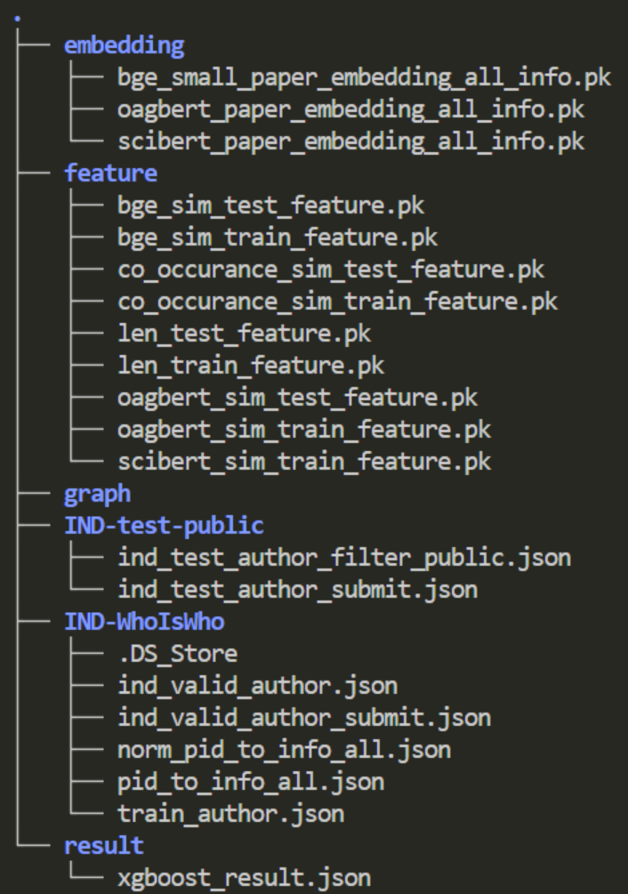
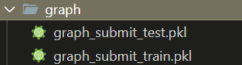

# WhoIsWho-IND-KDD-2024 rank7

## Prerequisites

- Linux
- Python 3.10
- PyTorch 2.2.0+cu121

## Final Method

**Our final approach is to merge the results of the test set using the GCN model and the Xgboost machine learning model.**

|           Method            |    WAUC     |
| :-------------------------: | :---------: |
|             GCN             | 0.776(test) |
|           Xgboost           | 0.781(test) |
| （GCN* 0.1+ Xgboost*  0.9） |    0.801    |

## Getting Started

### Installation

Clone this repo.

```shell
https://github.com/qianlanzz/WhoIsWho-IND-KDD-2024.git
cd WhoIsWho-IND-KDD-2024
```

For `Xgboost`,

```shell
pip install -r Xgboost/requirements.txt
```

For `GCN`,

```shell
pip install -r GCN/requirements.txt
```

## IND Dataset and DataProcess

The dataset can be downloaded from [BaiduPan](https://pan.baidu.com/s/1_CX50fRxou4riEHzn5UYKg?pwd=gvza) with password gvza, [Aliyun](https://open-data-set.oss-cn-beijing.aliyuncs.com/oag-benchmark/kddcup-2024/IND-WhoIsWho/IND-WhoIsWho.zip) or [DropBox](https://www.dropbox.com/scl/fi/o8du146aafl3vrb87tm45/IND-WhoIsWho.zip?rlkey=cg6tbubqo532hb1ljaz70tlxe&dl=1). Unzip the dataset and put files into `dataset/` directory.

+ DataProcess

  Before training, we should normalize paper info and extract feature from paper info(title, abstract, auther name, auther org, keywords, veneu and year),those feature can be used in GCN method (That means you should first put dataset in the right place and use Xgboost's pre three commands). you can check the detail in Xgboost's README file and  you can generate those feature (include scores and embeddings) by following Xgboost from step1 to step3。

  **This process may takes a lot of time, please be patinet. If you need,  we will upload our processed file later.**

  #### update!!!

  you can download the  processed file from [dataset](https://drive.google.com/drive/folders/1WtMWXb4qv-oKStO0oL0cNS8guQHKHvqu?usp=drive_link), and put all file in dataset acrroding to File Struct.（Due to google drive storage limitations, we are unable to upload gcn training data, if you only need to test, the data provided here is sufficient）

+ Pretrained Model prepare

  We use three word embeddding tools(includeing [bge-small-en-v1.5](https://huggingface.co/BAAI/bge-small-en-v1.5)、[sci-bert]([allenai/scibert_scivocab_uncased at main (huggingface.co)](https://huggingface.co/allenai/scibert_scivocab_uncased/tree/main))  and oag-bert, oag-bert can be donwload by tool cogdl(in Xgboost requirements.txt)), you should download those pretrained model and put them in `model/` directory(except oag-bert and remember change download model name to  <u>bge-small-en-v1.5</u> and <u>scibert</u> ). 

## Run Method for [KDD Cup 2024](https://www.biendata.xyz/competition/ind_kdd_2024/)

We provide three Method: [GCN](https://arxiv.org/abs/1609.02907), Xgboost, and [ChatGLM](https://arxiv.org/abs/2210.02414) [[Hugging Face\]](https://huggingface.co/THUDM/chatglm3-6b-32k). 

For `Xgboost`,

​	Do feature engineering and train xgboost model to predict results at 10 fold

+ train and predict

```shell
cd Xgboost
# step1: Preprocessing Data
python norm_data.py
# step2: Embedding vector
python encode.py
# step3: Get features
python get_feature.py
# step4: predict
python predict.py

or bash run.sh
```

+ predict

  Pretrained gcn model can be downloaded from [xgb_model](https://drive.google.com/file/d/1UR9FYDsQYMQOVF3Mg0hZSNb0lDlQMIaa/view?usp=drive_link) ,and put it in `model/xgb_model`.

  ```
  python infer.py
  ```

For `GCN`,

​	Build graph relational data, train and predict results using gcn model.

+ train and predict

  ```
  export CUDA_VISIBLE_DEVICES='?'  # specify which GPU(s) to be used
  cd GCN
  # as same as Xgboost pre three command 
  #python norm_data.py
  #python encode.py
  #python get_feature.py
  python build_graph.py 
  bash train.sh #include train and predict
  ```

+ predict

  Pretrained gcn model can be downloaded from (gcn_model)[https://drive.google.com/drive/folders/17Y7QhOdvkj76dCUxyOS0kyJpTg-0Vrg2?usp=drive_link] ,and put it in `model/gcn_model`.

  ```
  python predict.py
  ```


### Result

`Model Merge`

```shell
python merge.py --gcn_rsult your_gcn_file --ml_result your_ml_reslut
```

## File Struct

```shell
.
├── dataset
│   ├── embedding
│   ├── feature
│   ├── graph
│   └── result
├── GCN
│   ├── build_graph.py
│   ├── encode.py
│   ├── get_feature.py
│   ├── models.py
│   ├── norm_data.py
│   ├── README.md
│   ├── requirements.txt
│   ├── train.py
│   ├── predict.py
│   └── train.sh
├── merge.py
├── model
	├── gcn_model
	└── xgb_model
├── README.md
└── Xgboost
    ├── encode.py
    ├── get_feature.py
    ├── norm_data.py
    ├── predict.py
    ├── README.md
    ├── requirements.txt
    ├── run.sh
    └── infer.py
```

and in `dataset/`



in `dataset/graph/`


